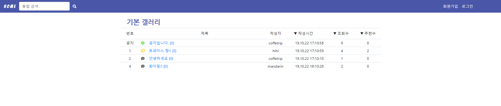

# eunji-gallery

#### Django 프레임워크 기반 커뮤니티 게시판 웹 페이지 구현 (Bootstrap4 적용)


## 1. 데이터베이스 설계

```python
# 게시물
class Article(models.Model):
    title = models.CharField(max_length=100)
    user = models.ForeignKey(settings.AUTH_USER_MODEL, on_delete=models.CASCADE)
    content = models.TextField()
    created_at = models.DateTimeField(auto_now_add=True)
    # 사진 업로드
    image = ProcessedImageField(
                null=True,
                blank=True,
                processors=[ResizeToFill(300,300)],
                format='JPEG',
                options={'quality':90},
                upload_to='articles'
            )
    info = models.BooleanField()
    # 좋아요 N:M 관계 설정
    like_users = models.ManyToManyField(settings.AUTH_USER_MODEL, related_name='like_articles')
    views = models.IntegerField(default=0)
   
# 댓글
class Comment(models.Model):
  	# 게시물과 1:N, 유저와 1:N 관계 설정
    article = models.ForeignKey(Article, on_delete=models.CASCADE)
    user = models.ForeignKey(settings.AUTH_USER_MODEL, on_delete=models.CASCADE)
    content = models.CharField(max_length=200)
    created_at = models.DateTimeField(auto_now_add=True)
    image = ProcessedImageField(
                null=True,
                blank=True,
                processors=[ResizeToFill(100,100)],
                format='JPEG',
                options={'quality':90},
                upload_to='articles'
            )
```


## 2. 주요기능 구현

- #### 메인 화면

> 공지/사진첨부/사진미첨부된 게시물 3가지로 구분하여 아이콘이 달린다. 작성시간/조회수/추천수에 따라 정렬이 가능하다.



views.py

```python
def index(request):
    like = False
    view = False
    time = False
    if request.GET.get('likedesc'):
        articles = Article.objects.annotate(like_count=Count('like_users')).order_by('-like_count')
    elif request.GET.get('likeasc'):
        like = True
        articles = Article.objects.annotate(like_count=Count('like_users')).order_by('like_count')
    elif request.GET.get('viewdesc'):
        articles = Article.objects.all().order_by('-views')
    elif request.GET.get('viewasc'):
        view = True
        articles = Article.objects.all().order_by('views')
    elif request.GET.get('timedesc'):
        articles = Article.objects.all().order_by('-created_at')
    elif request.GET.get('timeasc'):
        time = True
        articles = Article.objects.all().order_by('created_at')
    else:
        articles = Article.objects.all()

    context = {
        'articles': articles,
        'like': like,
        'view': view,
        'time': time
    }
    return render(request, 'articles/index.html', context)
```

templates > index.html

```html
<table class="table table-sm">
  <thead>
    <tr>
      <th scope="col" class="text-center"><span class="btn">번호</span></th>
      <th></th>
      <th scope="col" class="text-center"><span class="btn">제목</span></th>
      <th scope="col" class="text-center"><span class="btn">작성자</span></th>
      <th>
        <!-- 해당하는 name을 각각 GET방식으로 보내기 -->
        <form action="">
          
            <input class="btn" type="submit" name='timedesc' value="▲ 작성시간">
          
            <input class="btn" type="submit" name='timeasc' value="▼ 작성시간">
          
        </form>
      </th>
      <th>
        <form action="">
          
            <input class="btn" type="submit" name='viewdesc' value="▲ 조회수">
          
            <input class="btn" type="submit" name='viewasc' value="▼ 조회수">
          
        </form>
      </th>
      <th class="text-center" scope="col">
        <form action="">
          
            <input class="btn" type="submit" name='likedesc' value="▲ 추천수">
          
            <input class="btn" type="submit" name='likeasc' value="▼ 추천수">
          
        </form>
      </th>
    </tr>
  </thead>
  <tbody>
    <!-- 공지사항은 맨 위에서 보여주기 -->
    
      
        <tr>
          <td class="text-center" width="7%">공지</td>
          <td width="3%"><i class="fas fa-info-circle" style="color:#82EB5A;"></i></td>
          <td width="40%"><a href="">{{article.title}} [{{article.comment_set.count}}]</a></td>
          <td class="text-center" width="10%">{{article.user}}</td>
          <td class="text-center" width="14%">{{article.created_at|date:'y.m.d H:m:s'}}</td>
          <td class="text-center" width="8%">{{article.views}}</td>
          <td class="text-center" width="8%">{{article.like_users.count}}</td>
        </tr>
      
    
  </tbody>
  <tbody>
    
      
        <tr>
          <td class="text-center" width="7%">{{article.id}}</td>
          <td>
            <!-- 이미지첨부된 게시물 구분 -->
            
              <i class="fas fa-images" style="color:#FFDC3C;"></i>
            
              <i class="fas fa-comment-dots" style="color:#696969;"></i>
            
          </td>
          <td width="40%"><a href="">{{article.title}} [{{article.comment_set.count}}]</a></td>
          <td class="text-center" width="10%" class="text-right">{{article.user}}</td>
          <td class="text-center" width="14%" class="text-right">{{article.created_at|date:'y.m.d H:m:s'}}</td>
          <td class="text-center" width="8%">{{article.views}}</td>
          <td class="text-center" width="8%">{{article.like_users.count}}</td>
        </tr>
        </tr>
      
    
  </tbody>
</table>
```

- #### 상세정보 화면

> 좋아요, 댓글기능이 있다. 로그인된 사용자만 글 작성할 수 있고, 게시물작성자만 수정/삭제할 수 있다. 게시물과 댓글에 사진업로드가 가능하고, 댓글 작성자만 입력한 댓글을 삭제할 수 있다.


views.py

```python
# 로그인한 사용자만 글 작성이 가능하다.
@login_required
def create(request):
    if request.method=='POST':
        # 중복을 줄이고 잘못된 데이터가 입력되지 않도록 모델폼을 사용
        form = ArticleForm(request.POST, request.FILES)
        if form.is_valid():
            article = form.save(commit=False)
            article.user = request.user
            if article.image:
                article.image = request.FILES['image']
            article.save()
            return redirect('articles:index')
    else:
        form = ArticleForm()
    context = {
        'form': form
    }
    return render(request, 'articles/form.html', context)

def like(request, id):
    article = get_object_or_404(Article, id=id)
    user = request.user
    # 이미 좋아요한 경우 취소
    if article.like_users.filter(id=user.id):
        article.like_users.remove(user)
    # 하지않은 경우 좋아요추가
    else:
        article.like_users.add(user)
    return redirect('articles:detail', id)
```

templates > detail.html

```html
<!-- 작성자만 게시물 수정/삭제가 가능하다. -->

          <a href="" class="card-link" style="color:#4a57a8;">수정</a>
          <a href="" class="card-link" style="color:#4a57a8;">삭제</a>
        
```

- #### 통합검색 화면

> 키워드로 통합검색을 하면 제목/내용으로 구분되어 검색결과를 보여준다.


views.py

```python
def search(request):
    if request.GET.get('keyword'):
        search_type = 'contains'
        # 제목 검색결과
        articles = Article.objects.filter(title__contains=request.GET.get('keyword')).order_by('-created_at')
        # 내용 검색결과
        articles2 = Article.objects.filter(content__contains=request.GET.get('keyword')).order_by('-created_at')
        return render(request, 'articles/search.html', {'articles': articles, 'articles2': articles2})
    else:
        return redirect('articles:index')
```

- #### 마이페이지 화면

> 로그인한 사용자가 쓴 글과 댓글을 모두 보여준다.


views.py

```python
def mypage(request):
    articles = Article.objects.filter(user=request.user)
    comments = Comment.objects.filter(user=request.user)
    context = {
        'articles': articles,
        'comments': comments
    }
    return render(request, 'articles/mypage.html', context)
```
